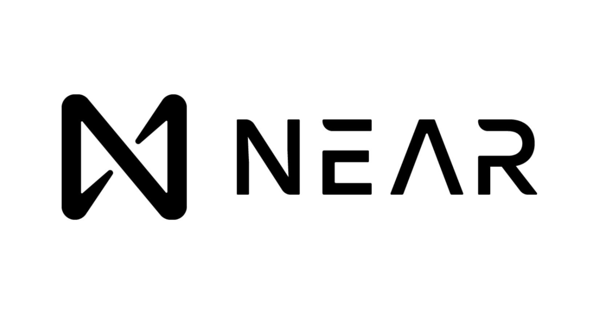

# Workshop NEAR Protocol

Bem-vindo ao Workshop NEAR! Este material foi desenvolvido para ensinar desde os conceitos básicos de blockchain até o desenvolvimento de aplicações descentralizadas na plataforma NEAR.

## 📚 Sobre o Workshop

Este workshop presencial de 1-2 dias foi projetado para desenvolvedores de todos os níveis:
- **Iniciantes**: Aprenda os fundamentos de blockchain do zero
- **Intermediários**: Entenda as diferenças entre blockchains e conceitos técnicos
- **Avançados**: Aprofunde-se em NEAR e desenvolva aplicações reais

---

## 📖 Índice do Conteúdo

### 🎯 Módulo 1: Fundamentos de Blockchain
**Para quem está começando**

1. [O que é Blockchain?](./docs/01-fundamentos-blockchain.md)
   - Conceitos básicos
   - Como funciona uma blockchain
   - Diferenças entre blockchains públicas e privadas
   - Casos de uso reais

### 🔗 Módulo 2: Conhecendo NEAR Protocol
**Entendendo a plataforma**

2. [O que é NEAR?](./docs/02-o-que-e-near.md)
   - Por que escolher NEAR?
   - Vantagens técnicas
   - Comparação com outras blockchains
   - Ecossistema NEAR

3. [Conceitos Fundamentais da NEAR](./docs/03-conceitos-near.md)
   - Sistema de contas
   - Chaves de acesso
   - Diferenças entre NEAR e Ethereum
   - Tipos de endereços

### 🛠️ Módulo 3: Configuração do Ambiente
**Preparando para desenvolver**

4. [Instalação e Configuração](./docs/04-instalacao-configuracao.md)
   - Instalação do Node.js e npm
   - Configuração de ambiente virtual
   - Instalação da NEAR CLI
   - Criação de carteira testnet

### 💻 Módulo 4: Smart Contracts
**Desenvolvendo na NEAR**

5. [Introdução aos Smart Contracts](./docs/05-smart-contracts-introducao.md)
   - O que são smart contracts?
   - Onde vivem os contratos?
   - O que podem e não podem fazer?
   - Exemplos de uso

6. [Redes e Runtime NEAR](./docs/06-redes-runtime.md)
   - Mainnet vs Testnet vs Localnet
   - Arquitetura da NEAR
   - Transações e receipts
   - Sistema baseado em contas

### 🌐 Módulo 5: Conceitos Avançados
**Indo além do básico**

7. [Chain Abstraction e Multichain](./docs/07-multichain-abstraction.md)
   - O que é Chain Abstraction?
   - Contas multi-chain
   - Swaps via Intents
   - OmniBridge

---

## 🎓 Como Usar Este Material

### Para Iniciantes
1. Comece pelo [Módulo 1](./docs/01-fundamentos-blockchain.md) para entender blockchain
2. Avance para o [Módulo 2](./docs/02-o-que-e-near.md) para conhecer NEAR
3. Siga para o [Módulo 3](./docs/04-instalacao-configuracao.md) para configurar seu ambiente
4. Pratique com o [Módulo 4](./docs/05-smart-contracts-introducao.md)

### Para Desenvolvedores Experientes
1. Revise rapidamente os [conceitos NEAR](./docs/03-conceitos-near.md)
2. Configure o [ambiente](./docs/04-instalacao-configuracao.md)
3. Mergulhe em [Smart Contracts](./docs/05-smart-contracts-introducao.md)
4. Explore [conceitos avançados](./docs/07-multichain-abstraction.md)

---

## 🔧 Pré-requisitos

- Computador com Linux, macOS ou Windows
- Conhecimento básico de programação
- Vontade de aprender! 🌟

---

## 📝 Estrutura do Workshop

### Dia 1 (Manhã)
- Fundamentos de Blockchain
- Introdução à NEAR
- Configuração do Ambiente

### Dia 1 (Tarde)
- Conceitos de contas e chaves
- Primeiro smart contract
- Deploy e testes

### Dia 2 (Manhã)
- Redes NEAR e arquitetura
- Desenvolvimento de DApp completo

### Dia 2 (Tarde)
- Chain Abstraction
- Multichain
- Projeto prático

---

## 🌟 Princípios do Workshop

> **O simples é melhor**: Começamos pelos conceitos básicos e construímos gradualmente

> **Abstrações ajudam**: Entendemos a tecnologia sem nos perder em detalhes técnicos desnecessários

> **Prática é essencial**: Cada conceito vem acompanhado de exemplos práticos

---

## 🔗 Links Úteis

- [Documentação Oficial NEAR](https://docs.near.org)
- [NEAR Explorer (Testnet)](https://testnet.nearblocks.io)
- [NEAR Wallet](https://wallet.near.org)
- [NEAR GitHub](https://github.com/near)

---

## 💬 Dúvidas e Suporte

Durante o workshop, não hesite em fazer perguntas! Este é um ambiente de aprendizado colaborativo.

---

## 📄 Licença

Este material é fornecido para fins educacionais.

---

Vamos começar? 🚀 Siga para o [Módulo 1: Fundamentos de Blockchain](./docs/01-fundamentos-blockchain.md)
