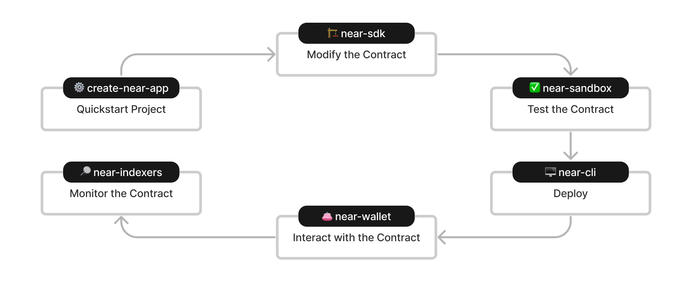
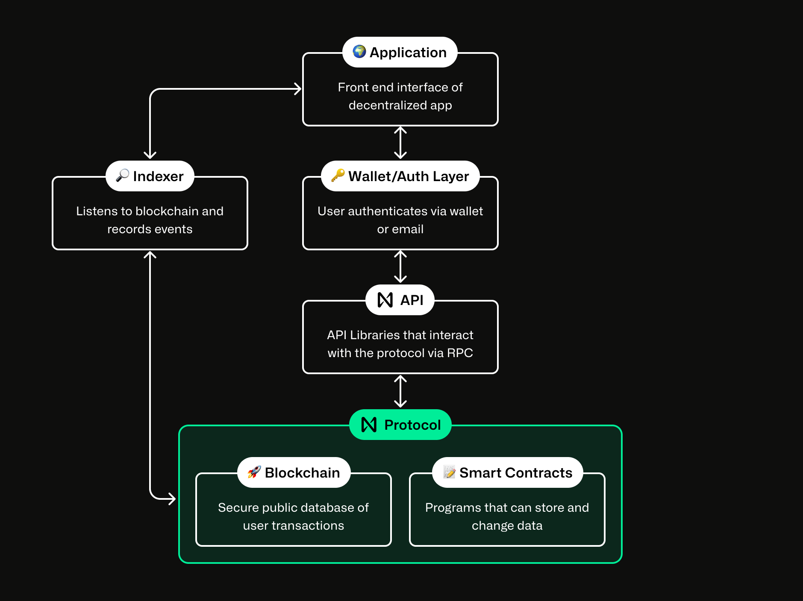

# 💻 Módulo 5: Introdução aos Smart Contracts

[← Anterior: Instalação](./04-instalacao-configuracao.md) | [Voltar ao Índice](../README.md) | [Próximo: Redes e Runtime →](./06-redes-runtime.md)

---



## 🤔 O que é um Smart Contract?

Um **smart contract** (contrato inteligente) é um **programa que roda na blockchain**.

### Analogia Simples

Pense em uma **máquina de venda automática**:

```
🎰 Máquina de Venda             📝 Smart Contract
├─ Você coloca dinheiro        ├─ Você envia tokens
├─ Escolhe o produto           ├─ Chama uma função
├─ Máquina verifica valor      ├─ Contrato verifica condições
└─ Entrega o produto           └─ Executa ação automaticamente
```

**Diferença**: Smart contracts são:
- ✅ Transparentes (código público)
- ✅ Imutáveis (não podem ser alterados*)
- ✅ Sem intermediários (automáticos)
- ✅ Confiáveis (sempre executam como programado)

*Na NEAR contratos PODEM ser atualizados, mas de forma controlada

---

## 📦 Onde Vivem os Contratos?

Smart contracts **vivem dentro de contas NEAR**.

```
┌─────────────────────────────────────┐
│  contador.seunome.testnet           │
├─────────────────────────────────────┤
│  💰 Balance: 5 NEAR                 │
│                                     │
│  📝 Contract Code (WASM):           │
│     ├─ increment()                  │
│     ├─ decrement()                  │
│     └─ get_count()                  │
│                                     │
│  💾 Contract State:                 │
│     └─ count = 42                   │
└─────────────────────────────────────┘
```

**Qualquer conta pode ter um contrato!**
- Mas uma conta só pode ter **um** contrato por vez
- Você precisa pagar pelo armazenamento do código

---

## 💰 Quanto Custa?

### Storage (Armazenamento)

```
1 Ⓝ = 100 kilobytes

Exemplos:
- Contrato Hello World: ~0.01 Ⓝ (1kb)
- Contrato NFT simples: ~0.05 Ⓝ (5kb)
- Contrato DeFi complexo: ~0.5-2 Ⓝ (50-200kb)
```

### Gas (Execução)

```
Transação simples: ~0.0001 Ⓝ
Mint de NFT: ~0.005 Ⓝ
Swap complexo: ~0.01-0.05 Ⓝ
```

**Muito barato! 🎉**

---

## ⚡ Características dos Smart Contracts NEAR

### 1. 🚀 Rápidos

```
Tempo de finalização: ~1.3 segundos
Operações de leitura: Grátis e instantâneas
```

### 2. 💰 Baratos

```
Custo médio < $0.01 por transação
100x-1000x mais barato que Ethereum
```

### 3. 🔄 Assíncronos

Contratos podem chamar outros contratos:

```javascript
// Contrato A chama Contrato B
const promise = near.promiseBatchCreate("contractB.near")
  .functionCall("method", {}, 0, Gas(30));
```

### 4. 🧠 Limitados em Recursos

Por razões de segurança:
- ⏱️ **Tempo**: Execução limitada por gas
- 💾 **Memória**: Limitada por shard
- 🌐 **Internet**: Sem acesso direto
- 🤖 **Automação**: Não executam sozinhos

---

## ✅ O que Contratos PODEM Fazer?

### 1. 💸 Transferir Tokens

```javascript
@call({})
send_money({ receiver, amount }) {
  return near.promiseBatchCreate(receiver)
    .transfer(BigInt(amount));
}
```

### 2. 📞 Chamar Outros Contratos

```javascript
@call({})
call_other_contract() {
  return near.promiseBatchCreate("outro.near")
    .functionCall("metodo", {}, 0, Gas(30));
}
```

### 3. 👶 Criar Novas Contas

```javascript
@call({})
create_account({ new_account }) {
  return near.promiseBatchCreate(new_account)
    .createAccount()
    .transfer(BigInt(parseNear("1")));
}
```

### 4. 🔄 Atualizar Seu Próprio Código

```javascript
@call({})
update({ code }) {
  return near.promiseBatchCreate(near.currentAccountId())
    .deployContract(code);
}
```

### 5. 💾 Armazenar Dados

```javascript
@call({})
save_data({ key, value }) {
  this.data.set(key, value);
}

@view({})
get_data({ key }) {
  return this.data.get(key);
}
```

---

## ❌ O que Contratos NÃO PODEM Fazer?

### 1. 🌐 Acessar Internet

```javascript
// ❌ NÃO FUNCIONA
@call({})
async get_weather() {
  const response = await fetch('https://api.weather.com');  // ERRO!
  return response.json();
}
```

**Solução**: Use Oráculos (serviços externos que alimentam dados)

### 2. 🤖 Executar Automaticamente

```javascript
// ❌ NÃO EXECUTA SOZINHO
@call({})
daily_task() {
  // Precisa ser chamado por alguém!
  // Não executa automaticamente todo dia
}
```

**Solução**: Use cronJobs externos ou incentive usuários a chamar

### 3. 🎲 Gerar Números Verdadeiramente Aleatórios

```javascript
// ⚠️ PREVISÍVEL
@call({})
random() {
  return Math.random();  // Não é seguro para blockchain!
}
```

**Solução**: Use VRF (Verifiable Random Function) ou oráculos

---

## 🛠️ Linguagens de Programação

### 🟨 JavaScript (TypeScript)

**Vantagens:**
- ✅ Fácil de aprender
- ✅ Comunidade gigante
- ✅ Rápido para prototipar
- ✅ Mesma linguagem do frontend

**Exemplo:**
```javascript
import { NearBindgen, call, view, near } from 'near-sdk-js';

@NearBindgen({})
class Counter {
  count: number = 0;

  @view({})
  get_count(): number {
    return this.count;
  }

  @call({})
  increment() {
    this.count += 1;
    near.log(`Contador agora é: ${this.count}`);
  }
}
```

### 🦀 Rust

**Vantagens:**
- ✅ Mais eficiente (gas)
- ✅ Mais seguro (type system)
- ✅ Melhor para contratos complexos
- ✅ Comunidade NEAR usa muito

**Exemplo:**
```rust
use near_sdk::{near_bindgen, env};

#[near_bindgen]
#[derive(Default)]
pub struct Counter {
    count: i32,
}

#[near_bindgen]
impl Counter {
    pub fn get_count(&self) -> i32 {
        self.count
    }

    pub fn increment(&mut self) {
        self.count += 1;
        env::log_str(&format!("Contador agora é: {}", self.count));
    }
}
```

### Qual Escolher?

| Situação | Recomendação |
|---|---|
| Iniciante em programação | JavaScript |
| Experiência com JS/TS | JavaScript |
| Contrato simples/MVP | JavaScript |
| Performance crítica | Rust |
| Lida com muito dinheiro | Rust |
| Contratos DeFi complexos | Rust |

---

## 🎯 Exemplos de Uso

### 1. 💰 Vaquinha (Crowdfunding)

```javascript
@NearBindgen({})
class Crowdfunding {
  goal: bigint;
  raised: bigint = 0n;
  deadline: number;
  beneficiary: string;

  @call({ payableFunction: true })
  donate() {
    const amount = near.attachedDeposit();
    this.raised += amount;
    
    if (this.raised >= this.goal) {
      near.log("Meta atingida! 🎉");
    }
  }

  @call({})
  finalize() {
    if (Date.now() > this.deadline) {
      if (this.raised >= this.goal) {
        // Transferir para beneficiário
        return near.promiseBatchCreate(this.beneficiary)
          .transfer(this.raised);
      } else {
        // Reembolsar doadores
        near.log("Meta não atingida. Reembolsando...");
      }
    }
  }
}
```

### 2. 🎫 Sistema de Votação

```javascript
@NearBindgen({})
class Voting {
  proposals: Map<string, Proposal> = new Map();
  votes: Map<string, Map<string, boolean>> = new Map();

  @call({})
  create_proposal({ id, description }) {
    this.proposals.set(id, {
      description,
      votesFor: 0,
      votesAgainst: 0
    });
  }

  @call({})
  vote({ proposalId, voteFor }) {
    const voter = near.signerAccountId();
    
    // Verificar se já votou
    if (this.votes.get(proposalId)?.get(voter)) {
      throw new Error("Já votou!");
    }

    // Registrar voto
    const proposal = this.proposals.get(proposalId);
    if (voteFor) {
      proposal.votesFor++;
    } else {
      proposal.votesAgainst++;
    }
    
    // Marcar como votado
    if (!this.votes.has(proposalId)) {
      this.votes.set(proposalId, new Map());
    }
    this.votes.get(proposalId).set(voter, true);
  }
}
```

### 3. 🎨 NFT Simples

```javascript
@NearBindgen({})
class SimpleNFT {
  tokens: Map<string, Token> = new Map();
  tokenId: number = 0;

  @call({ payableFunction: true })
  mint({ metadata }) {
    const owner = near.signerAccountId();
    const id = this.tokenId.toString();
    
    this.tokens.set(id, {
      owner,
      metadata
    });
    
    this.tokenId++;
    near.log(`NFT #${id} criado para ${owner}`);
    return id;
  }

  @call({})
  transfer({ tokenId, newOwner }) {
    const token = this.tokens.get(tokenId);
    
    if (token.owner !== near.signerAccountId()) {
      throw new Error("Não é o dono!");
    }
    
    token.owner = newOwner;
    this.tokens.set(tokenId, token);
  }

  @view({})
  get_token({ tokenId }) {
    return this.tokens.get(tokenId);
  }
}
```

---

## 🔄 Ciclo de Vida de um Contrato



```
1. 💻 Desenvolvimento
   ├─ Escrever código (JS ou Rust)
   └─ Testar localmente

2. 🏗️ Compilação
   ├─ JavaScript → WASM
   └─ Rust → WASM

3. 🧪 Testes
   ├─ Testes unitários
   ├─ Testes de integração
   └─ Testnet

4. 🚀 Deploy
   ├─ Upload do WASM
   └─ Inicialização

5. 📞 Uso
   ├─ Chamadas de leitura (@view)
   └─ Chamadas de escrita (@call)

6. 🔄 Manutenção
   ├─ Monitoramento
   ├─ Atualizações
   └─ Migrações
```

---

## 🔒 Segurança em Smart Contracts

### Princípios Fundamentais

#### 1. **Dinheiro Real Está em Jogo**
```javascript
// ⚠️ CUIDADO: Este código lida com dinheiro real!
@call({ payableFunction: true })
withdraw() {
  const amount = this.balances.get(near.signerAccountId());
  // Verificações rigorosas necessárias!
}
```

#### 2. **Código é Imutável (quase)**
- Uma vez deployed, bugs são difíceis de corrigir
- Sempre teste exaustivamente
- Use padrões de upgrade se necessário

#### 3. **Tudo é Público**
```javascript
// ❌ Não há dados "privados"
private secretKey = "12345";  // Todos podem ver!

// ✅ Use criptografia se necessário
```

### Checklist de Segurança

- ✅ Validar TODOS os inputs
- ✅ Verificar autorização (quem está chamando?)
- ✅ Prevenir reentrância
- ✅ Limitar gas para chamadas externas
- ✅ Testar edge cases
- ✅ Auditar código complexo
- ✅ Usar padrões conhecidos

---

## 🧪 Testando Contratos

### Testes Locais (Sandbox)

```javascript
// test.js
import { Worker } from 'near-workspaces';

async function main() {
  const worker = await Worker.init();
  const root = worker.rootAccount;

  // Deploy do contrato
  const contract = await root.createSubAccount('test');
  await contract.deploy('./out/contract.wasm');

  // Testar método
  await contract.call(contract, 'increment', {});
  const count = await contract.view('get_count', {});
  
  console.log(`Count: ${count}`);  // Deve ser 1
}

main();
```

### Testes na Testnet

```bash
# Deploy na testnet
near contract deploy contador.seunome.testnet \
  use-file ./out/contract.wasm without-init-call \
  network-config testnet sign-with-keychain send

# Chamar método
near contract call-function as-transaction \
  contador.seunome.testnet increment json-args '{}' \
  prepaid-gas '30 TeraGas' attached-deposit '0 NEAR' \
  sign-as seunome.testnet network-config testnet \
  sign-with-keychain send

# Ver resultado
near contract call-function as-read-only \
  contador.seunome.testnet get_count json-args '{}' \
  network-config testnet now
```

---

## 📊 Gas e Otimização

### O que é Gas?

**Gas** é o combustível computacional:
- Cada operação consome gas
- Você paga pela computação
- Incentiva código eficiente

### Operações e Custos

```
Ler storage:     ~0.0001 Ⓝ
Escrever storage: ~0.0003 Ⓝ
Lógica simples:   ~0.00001 Ⓝ
Chamada cross-contract: ~0.001 Ⓝ
```

### Dicas de Otimização

```javascript
// ❌ Ineficiente
@view({})
expensive_loop() {
  let total = 0;
  for (let i = 0; i < 10000; i++) {
    total += this.data.get(i.toString());
  }
  return total;
}

// ✅ Melhor
@view({})
efficient() {
  return this.cachedTotal;  // Pré-calculado
}
```

---

## 🎓 Boas Práticas

### 1. Estrutura do Código

```javascript
import { NearBindgen, call, view, near, initialize } from 'near-sdk-js';

@NearBindgen({})
class MyContract {
  // Estado
  data: Map<string, string> = new Map();
  
  // Inicialização
  @initialize({})
  init({ owner }) {
    this.owner = owner;
  }
  
  // Métodos de escrita
  @call({})
  set_value({ key, value }) {
    this.data.set(key, value);
  }
  
  // Métodos de leitura
  @view({})
  get_value({ key }) {
    return this.data.get(key);
  }
}
```

### 2. Documentação

```javascript
/**
 * Incrementa o contador
 * @param amount - Quantidade a incrementar (opcional, padrão 1)
 * @returns Novo valor do contador
 */
@call({})
increment({ amount = 1 }) {
  this.count += amount;
  return this.count;
}
```

### 3. Logging

```javascript
@call({})
transfer({ receiver, amount }) {
  near.log(`Transferindo ${amount} para ${receiver}`);
  
  return near.promiseBatchCreate(receiver)
    .transfer(BigInt(amount));
}
```

---

## ❓ Perguntas Frequentes

**P: Posso atualizar meu contrato depois do deploy?**
R: Sim, se você mantiver essa funcionalidade. Implemente um método de upgrade.

**P: JavaScript é seguro o suficiente para DeFi?**
R: Para MVPs sim, mas Rust é recomendado para produção com muito valor.

**P: Como debugar contratos?**
R: Use `near.log()`, testes locais com near-workspaces, e testnet extensivamente.

**P: Contratos podem fazer pagamentos recorrentes?**
R: Não automaticamente. Precisa de um serviço externo para chamar periodicamente.

**P: Como garantir que meu contrato é seguro?**
R: Testes exaustivos, auditorias de código, e seguir padrões da comunidade.

---

## 🚀 Próximos Passos

Agora você entende smart contracts! Vamos explorar as redes NEAR.

👉 [Próximo: Redes e Runtime NEAR](./06-redes-runtime.md)

---

## 📚 Recursos Adicionais

- 📖 [NEAR SDK JS Docs](https://docs.near.org/sdk/js/introduction)
- 🦀 [NEAR SDK Rust Docs](https://docs.near.org/sdk/rust/introduction)
- 💡 [Exemplos de Contratos](https://github.com/near-examples)
- 🎓 [NEAR University](https://www.near.university/)

---

[← Anterior: Instalação](./04-instalacao-configuracao.md) | [Voltar ao Índice](../README.md) | [Próximo: Redes e Runtime →](./06-redes-runtime.md)
